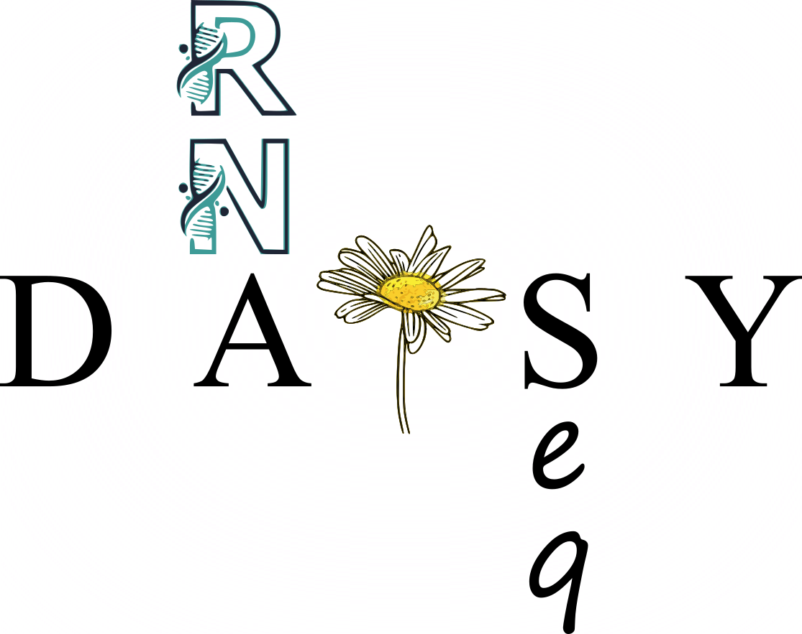

# Differential expression Analysis in ShinY for RNA seq

This interactive Shiny application aims to facilitate and automate the analysis of functional enrichment analysis. 

## Context: 
- Course : Bioinformatics in Omics Sciences - NGS sequencing data analysis and annotation - [S3-UE5]
- Master of BioInformatics Modeling and Statistics, Rouen University 

## How to cite:
Bardon A, Bottin F, Bencheickh S, Levon S., Vergne N, Dauchel H. DAISY RNAseq : Differential expression Analysis in ShinY for RNA seq. 2022.
